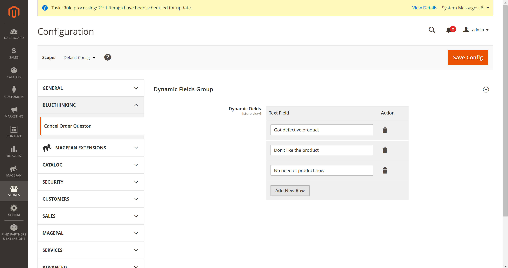
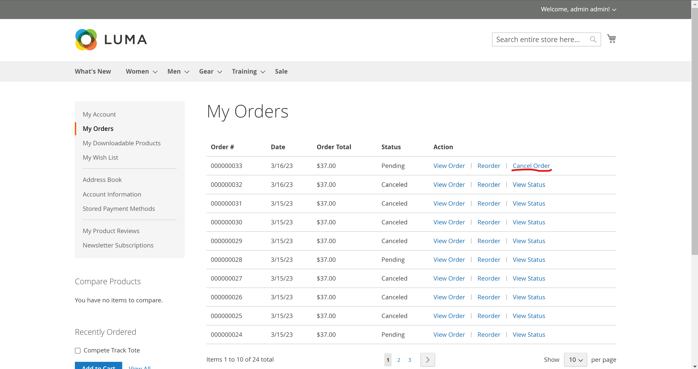
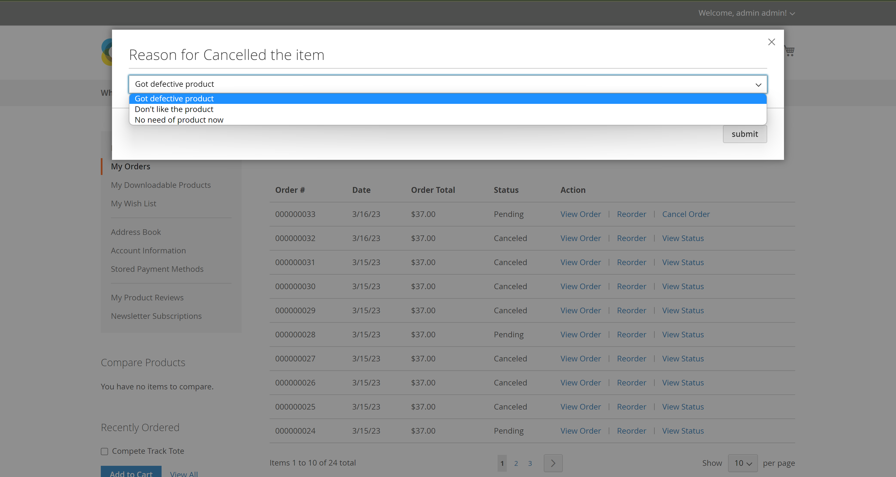
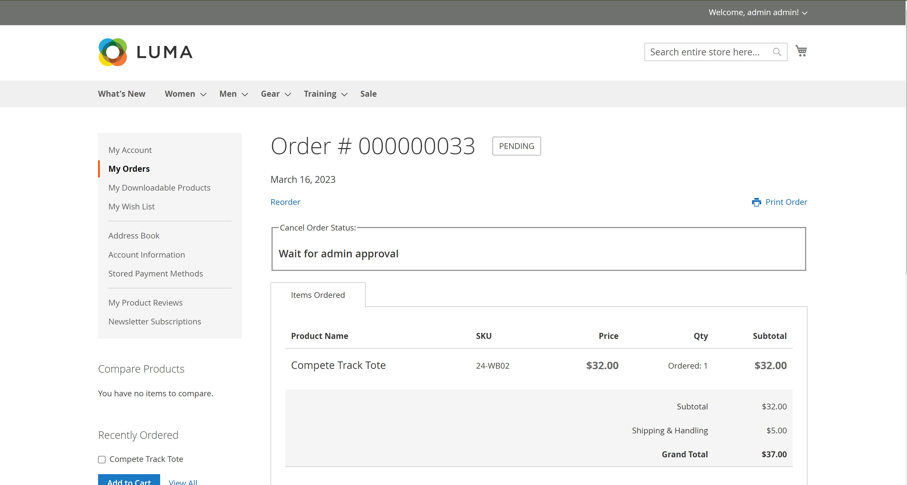
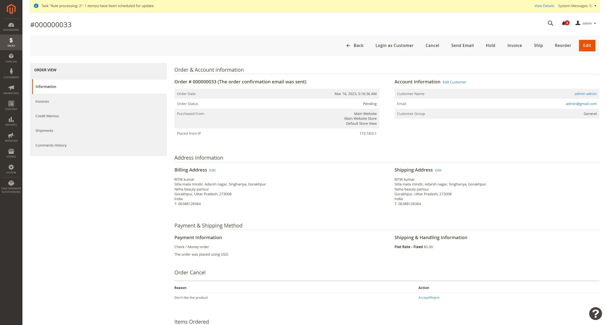
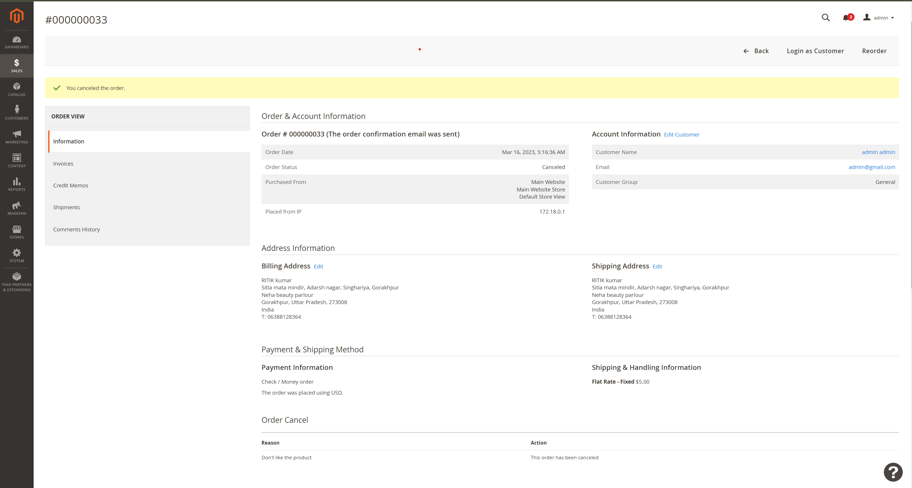
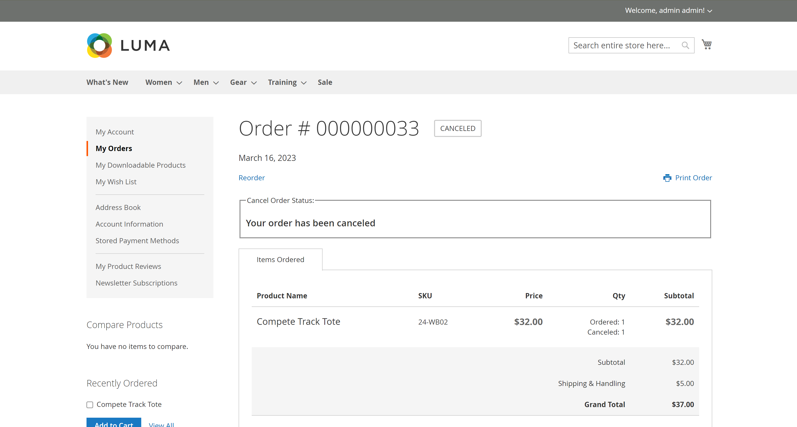
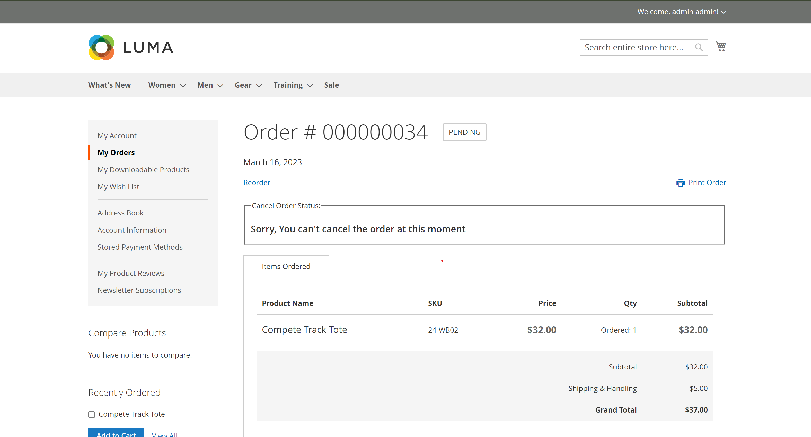

# Cancel Order Module

## Overview

-   Magento doesn't provide Customer to cancel order through Frontend. This module give customer an additional feature to raise a cancel order request through My Order section before Shipping of Item.

-   Admin can Accept/Reject the cancel order request from Admin Panel with an Easy click.

